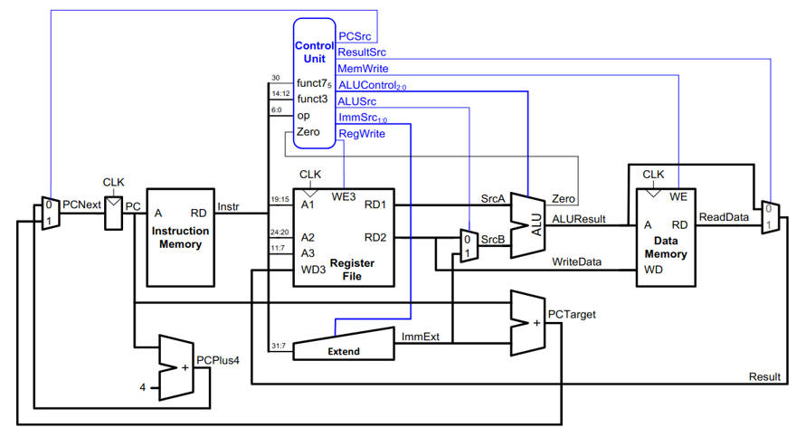
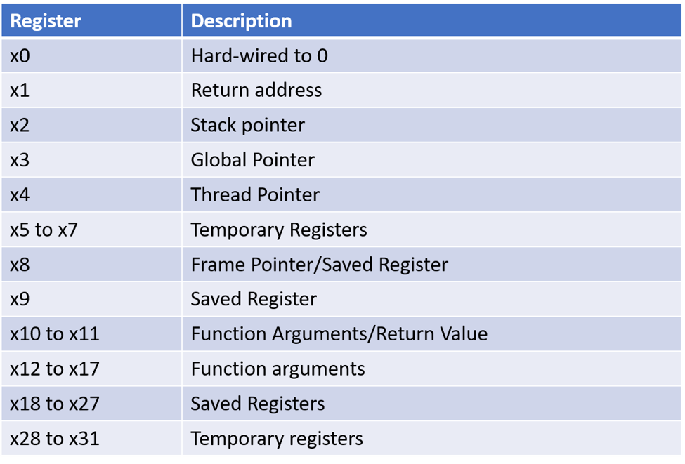
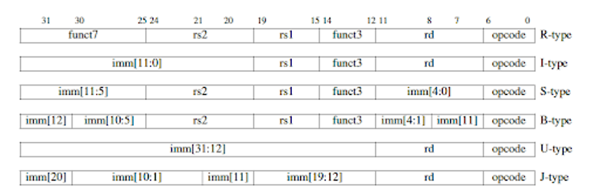
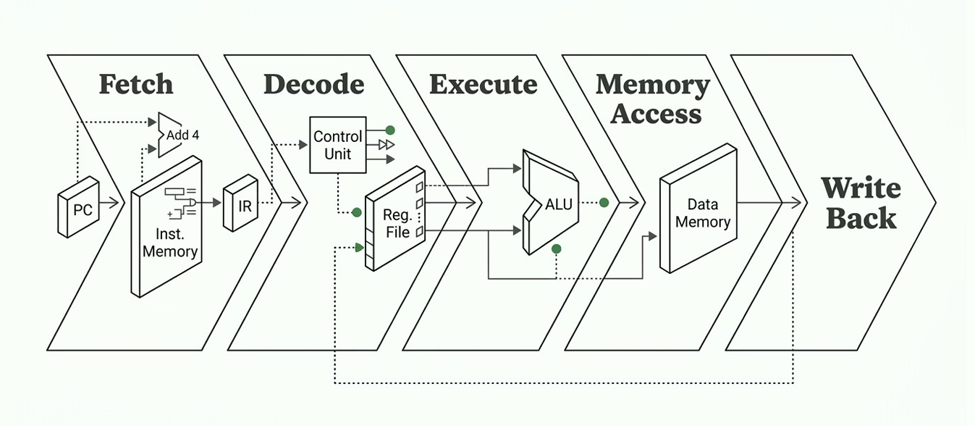

# RISC-V 2-Stage Pipelined Processor

> A 32-bit RISC-V processor with a 2-stage pipeline, implemented in Verilog HDL and simulated in Xilinx Vivado.



---

## Table of Contents

- [Overview](#overview)
- [RISC vs CISC vs ARM](#risc-vs-cisc-vs-arm)
- [Architecture: Single-Cycle Datapath](#architecture-single-cycle-datapath)
- [Hardware Components](#hardware-components)
- [Registers in RISC-V](#registers-in-risc-v)
- [Instruction Set](#instruction-set)
- [Pipelining](#pipelining)
- [Pipeline Hazards](#pipeline-hazards)
- [Project Details](#project-details)
- [Simulation Results](#simulation-results)
- [Observations & Results](#observations--results)
- [Challenges & Learnings](#challenges--learnings)
- [Future Improvements](#future-improvements)
- [Tools & Technologies](#tools--technologies)
- [References](#references)

---

## Overview

RISC (Reduced Instruction Set Computer) is a microprocessor architecture designed to simplify hardware using a small, highly-optimized set of instructions. Unlike CISC (Complex Instruction Set Computer), RISC focuses on executing simpler instructions faster and more efficiently.

This project implements a **32-bit single-cycle RISC-V processor** with a **2-stage pipeline** using Verilog HDL, verifying correct execution of key RV32I instructions through testbenches and waveform simulation in Xilinx Vivado.

### Key Highlights

- Designed a 32-bit single-cycle RISC-V processor in Verilog HDL
- Implemented all core modules: ALU, Register File, Control Unit, Instruction Memory, Data Memory
- Integrated all modules to execute RISC-V instructions in a single clock cycle
- Tested instructions: `add`, `addi`, `sub`, `and`, `or`, `xor`, `slt`, `lw`, `sw`
- Verified via testbenches and simulation waveforms in Vivado

---

## RISC vs CISC vs ARM

| Feature | RISC | CISC | ARM |
|---|---|---|---|
| Full Form | Reduced Instruction Set Computer | Complex Instruction Set Computer | Advanced RISC Machine |
| Instruction Size | Fixed | Variable | Mostly Fixed |
| Complexity | Simple | Complex | Simple |
| Execution Speed | Fast | Slower per instruction | Fast |
| Hardware Design | Easier | Difficult | Moderate |
| Power Consumption | Low | Higher | Very Low |
| Examples | RISC-V, MIPS | x86 | ARM Cortex |

### Advantages of RISC

- **Simpler Instructions** — Each instruction performs a basic operation (load, store, arithmetic)
- **Fixed Instruction Length** — Uniform size makes decoding straightforward
- **Single Clock Cycle Execution** — Most instructions complete in one cycle
- **More Registers** — Larger number of general-purpose registers
- **Simplified Addressing Modes** — Fewer and simpler addressing modes

### Limitations of RISC

- **Increased Code Size** — Complex tasks require more instructions
- **Higher Memory Usage** — More instructions mean higher memory requirements
- **Programming Complexity** — Developers may need to write more code for certain operations

---

## Architecture: Single-Cycle Datapath

The processor implements a classic single-cycle datapath where each instruction completes entirely within one clock cycle.


---

## Hardware Components

The processor is composed of the following hardware modules:

```
RISC-V
├── PC (Program Counter)
├── Register File
├── Memory
│   ├── Instruction Memory (INSTR MEM)
│   └── Data Memory (DATA MEM)
├── MUX
│   ├── PC MUX
│   ├── ALU MUX
│   └── Result MUX
├── Decoders
│   ├── ALU Decoder
│   └── Main Decoder
├── Adders
│   ├── PC+4 Adder
│   └── PC Target Adder
└── Immediate Extend Unit
```

### 1. ALU (Arithmetic Logic Unit)
Performs arithmetic operations (add, subtract, multiply, divide) and logical operations (AND, OR, XOR, etc.).

**Ports:** `ALU_ctrl[2:0]`, `src1[31:0]`, `src2[31:0]` → `ALU_result[31:0]`, `Zero`

### 2. Program Counter (PC)
Stores the address of the next instruction and provides it to instruction memory for fetching.

**Ports:** `PC_nxt[31:0]`, `clk`, `rst` → `PC[31:0]`

### 3. Register File
Contains 32 general-purpose 32-bit registers used to store data during execution.

**Ports:** `clk`, `rd[4:0]`, `reg_wr`, `rs1[4:0]`, `rs2[4:0]`, `wr_data[31:0]` → `data1[31:0]`, `data2[31:0]`

### 4. Instruction Memory
Stores all instructions sequentially. Each instruction is 4 bytes; the PC increments by 4 to fetch the next instruction.

**Ports:** `pc[31:0]` → `instr[31:0]`

### 5. Data Memory
Stores all program data. Supports read and write operations.

**Ports:** `clk`, `dta_address[31:0]`, `mem_wr`, `rst`, `wr_data[31:0]` → `rd_data[31:0]`

### 6. ALU Decoder
Part of the ALU control unit. Decodes instruction fields and signals the ALU which operation to perform.

### 7. Main Decoder (Control Unit)
Decodes instruction opcodes and generates all control signals (MUX selects, write enables, branch signals, etc.).

**Outputs:** `ALU_ctrl[2:0]`, `ALU_src`, `PC_src`, `branch`, `imm_src[1:0]`, `mem_wr`, `reg_wr`, `result_src`

### 8. PC+4 Adder
Adds 4 to the current PC value to prepare the address of the next sequential instruction.

**Ports:** `PC[31:0]` → `PCplus4[31:0]`

### 9. PC Target Adder
Adds an offset to the current PC for branch and jump instructions.

**Ports:** `PC[31:0]`, `imm_data[31:0]` → `PC_target[31:0]`

### 10. PC MUX
Selects whether the next PC should be the branch target address or PC+4.

**Ports:** `PC_src`, `PC_target[31:0]`, `PCplus4[31:0]` → `PC_nxt[31:0]`

### 11. Result MUX
Selects whether the result written back to the register file comes from the ALU or data memory.

**Ports:** `ALU_result[31:0]`, `rd_data[31:0]`, `result_src` → `result[31:0]`

### 12. ALU MUX
Selects whether the ALU's second operand is an immediate value or register data.

**Ports:** `ALU_src`, `data2[31:0]`, `imm_data[31:0]` → `src2[31:0]`

### 13. Immediate Extend Unit
Extracts and sign-extends the immediate value embedded in the instruction.

**Ports:** `imm_src[1:0]`, `instr[31:7]` → `imm_data[31:0]`

---

## Registers in RISC-V

RISC-V contains 32 general-purpose registers (x0–x31), providing fast storage for operands and intermediate results.



| Register | Description |
|---|---|
| x0 | Hard-wired to 0 |
| x1 | Return address |
| x2 | Stack pointer |
| x3 | Global Pointer |
| x4 | Thread Pointer |
| x5 – x7 | Temporary Registers |
| x8 | Frame Pointer / Saved Register |
| x9 | Saved Register |
| x10 – x11 | Function Arguments / Return Value |
| x12 – x17 | Function Arguments |
| x18 – x27 | Saved Registers |
| x28 – x31 | Temporary Registers |

---

## Instruction Set

An instruction set is the complete collection of commands a processor understands and can execute — arithmetic, memory, branch, and jump instructions.

### Instruction Formats

RISC-V uses six instruction encoding formats (R, I, S, B, U, J):



### Instruction Decoding

The decoder reads fields like `opcode`, `funct3`, `funct7`, `rs1`, `rs2`, and `rd`, then generates the control signals needed to execute the instruction correctly.

### Main Decoder Truth Table

| op | Instruction | RegWrite | ImmSrc | ALUSrc | MemWrite | ResultSrc | Branch | ALUOp | Jump |
|---|---|---|---|---|---|---|---|---|---|
| 3 | lw | 1 | 00 | 1 | 0 | 10 | 0 | 00 | 0 |
| 35 | sw | 0 | 01 | 1 | 1 | XX | 0 | 00 | 0 |
| 51 | R-type | 1 | XX | 0 | 0 | 01 | 0 | 10 | 0 |
| 99 | beq | 0 | 10 | 0 | 0 | XX | 1 | 01 | 0 |
| 19 | I-type | 1 | 00 | 1 | 0 | 01 | 0 | 10 | 0 |
| 111 | jal | 1 | 11 | X | 0 | 10 | 0 | XX | 1 |

### ALU Decoder Truth Table

| ALUOp | funct3 | op₅, funct7₅ | Instruction | ALUControl₂:₀ |
|---|---|---|---|---|
| 00 | x | x | lw, sw | 000 (add) |
| 01 | x | x | beq | 001 (subtract) |
| 10 | 000 | 00, 01, 10 | add | 000 (add) |
| 10 | 000 | 11 | sub | 001 (subtract) |
| 10 | 010 | x | slt | 101 (set less than) |
| 10 | 110 | x | or | 011 (or) |
| 10 | 111 | x | and | 010 (and) |

---

## Pipelining

Pipelining is a CPU technique that allows multiple instructions to be processed simultaneously by overlapping their execution in different stages, improving overall throughput and efficiency.



### Pipeline Stages

| Stage | Name | Description |
|---|---|---|
| IF | Instruction Fetch | Retrieves the next instruction from memory |
| ID | Instruction Decode | Decodes the instruction; reads register operands |
| EX | Execute | Performs arithmetic or logical operations in the ALU |
| MEM | Memory Access | Reads or writes data from/to data memory |
| WB | Write Back | Writes the result back to the register file |

### Stage Partitioning (2-Stage Pipeline)

**Part 1 — Instruction Fetch Stage**
Modules responsible for fetching the next instruction:
- Program Counter (PC)
- PC Adder (PC+4)
- PC MUX
- Instruction Memory

**Part 2 — Decode / Execute Stage**
Modules that decode the instruction and perform computation:
- Register File
- Immediate Generator (Extend Unit)
- Control Unit
- ALU
- Data Memory
- Result MUX

> **Why do `Zero` and `Result` feed back from Part 2 to Part 1?**
> The ALU produces the `Zero` flag after comparing operands. Part 1 needs this to decide the next PC value for branch instructions like `BEQ`/`BNE`. For example, if `BEQ x1, x2, label` finds `x1 == x2`, the ALU sets `Zero=1` and Part 1 jumps to the branch target address.

---

## Pipeline Hazards

### A) Data Hazard
Occurs when an instruction requires data not yet produced by a previous instruction.

```asm
ADD x1, x2, x3
SUB x4, x1, x5   # x1 not ready yet

LW  x1, 0(x2)
ADD x3, x1, x4   # x1 not ready yet
```

### B) Control Hazard
Occurs when the processor doesn't know which instruction to fetch next due to a branch or jump.

```asm
BEQ x1, x2, label
ADD x3, x4, x5   # may be fetched incorrectly

JAL x1, function
SUB x6, x7, x8   # may be fetched incorrectly
```

### C) Structural Hazard
Occurs when two instructions require the same hardware resource simultaneously. In a properly designed 2-stage RISC-V pipeline with separate instruction and data memories, these are largely eliminated.

```asm
# Example: instruction fetch and data load both needing a single shared memory port
# Example: two instructions attempting to use the same ALU in the same cycle
```

---

## Project Details

### Top Module — `data_path`

```verilog
module data_path(
    input clk,
    input rst,
    output [31:0] result
);

    // Stage 1 Signals
    wire [31:0] PC_in;
    wire [31:0] PCplus4_in;
    wire [31:0] instr;
    wire [31:0] data1_in;
    wire [31:0] data2_in;
    wire [31:0] imm_data_in;

    wire ALU_src_in;
    wire result_src_in;
    wire mem_rd_in;
    wire mem_wr_in;
    wire reg_wr_in;
    wire branch_in;
    wire jump_in;

    wire [1:0] imm_src;
    wire [2:0] ALU_ctrl_in;

    // Pipeline Register Outputs ...
```

### Testbench — `datapath_tb`

```verilog
module datapath_tb(
);

    reg clk;
    reg rst;
    wire [31:0] result;

    data_path dut (
        .clk(clk),
        .rst(rst),
        .result(result)
    );

    always #5 clk = ~clk;

    initial begin
        clk = 0; rst = 0;
        #10 rst = 1;
        #100 $finish;
    end

endmodule
```

---

## Simulation Results

### Waveform Output

| Clock | Stage 1 | Stage 2 | Result Output |
|---|---|---|---|
| 1 | Fetch `addi x5, x0, 4` | Empty | Invalid/X |
| 2 | Fetch `addi x6, x0, 5` | Execute `addi x5, x0, 4` | 4 |
| 3 | Fetch `addi x7, x0, 6` | Execute `addi x6, x0, 5` | 5 |
| 4 | Fetch `sw x5, 0(x0)` | Execute `addi x7, x0, 6` | 6 |
| 5 | Fetch `sw x6, 4(x0)` | Execute `sw x5, 0(x0)` | 0 |
| 6 | Fetch `sw x7, 8(x0)` | Execute `sw x6, 4(x0)` | 4 |
| 7 | Fetch `add x5, x6, x7` | Execute `sw x7, 8(x0)` | 8 |
| 8 | Fetch `and x5, x5, x7` | Execute `add x5, x6, x7` | 11 |
| 9 | Fetch `or x5, x6, x7` | Execute `and x5, x5, x7` | 2 |
| 10 | Fetch `nop` | Execute `or x5, x6, x7` | 7 |
| 11 | Empty | Execute `nop` | 0 |

### Power Report

| Metric | Value |
|---|---|
| Total On-Chip Power | 15.247 W |
| Dynamic Power | 15.078 W (99%) |
| Signals | 2.657 W (18%) |
| Logic | 2.484 W (16%) |
| BRAM | 0.346 W (2%) |
| I/O | 9.590 W (64%) |
| Device Static | 0.169 W (1%) |
| Junction Temperature | 105.2°C |
| Ambient Temperature | 25.0°C |

### Utilization Report

| Module | Signals (W) | Data (W) | Logic (W) | BRAM (W) |
|---|---|---|---|---|
| RF (Register_File) | 0.794 | 0.783 | 0.898 | 0.346 |
| DM (Data_Memory) | 0.391 | 0.391 | 1.154 | <0.001 |
| PIPE_REG | 1.106 | 1.105 | 0.099 | <0.001 |
| ALU_UNIT | 0.172 | 0.172 | 0.175 | <0.001 |
| PC_UNIT | 0.122 | 0.122 | 0.105 | <0.001 |
| IMM_EXT | <0.001 | <0.001 | 0.03 | <0.001 |
| CU (Control_Unit) | <0.001 | <0.001 | 0.012 | <0.001 |
| PC4 (Adder_PC_Plus_4) | <0.001 | <0.001 | 0.005 | <0.001 |

---

## Observations & Results

During the development and simulation of the RISC-V processor, it was observed that correct instruction execution depended heavily on proper coordination between the datapath and control unit. Waveform analysis helped verify the functioning of modules such as the Program Counter, Register File, ALU, and memories, while also assisting in identifying and debugging integration issues between modules.

**Result:** A functional 32-bit single-cycle RISC-V processor was successfully designed, implemented, and simulated using Verilog HDL in Xilinx Vivado. The processor correctly executed the supported RV32I instructions and produced the expected outputs during simulation, demonstrating the complete processor design flow — instruction fetch, decode, execute, memory access, and write-back.

---

## Challenges & Learnings

### Challenges

1. **Managing a large number of signals and modules** — The project involved many modules with several input/output signals each. Tracking connections and interactions across the design required careful planning and documentation.

2. **Debugging errors in the top module** — Since the top module integrates all submodules, identifying bugs involved checking signal connections, module interfaces, and data flow between components.

### Learnings

1. **RISC-V processor architecture** — Gained a thorough understanding of the RISC-V ISA, its features, applications, and advantages such as simplicity, modularity, and open-source availability.

2. **Verilog coding and debugging** — Improved Verilog programming skills by designing hardware modules and verifying functionality through simulation and waveform analysis.

3. **Development and simulation tools** — Learned to use Xilinx Vivado for design, simulation, and synthesis, along with EDA Playground for testing Verilog code.

4. **Version control with Git** — Developed an understanding of Git for tracking changes, managing project versions, and maintaining the repository efficiently.

5. **System integration and module interfacing** — Learned how to combine individual modules into a complete processor and ensure proper communication between all parts.

---

## Future Improvements

1. Extend from single-cycle to a full pipelined architecture to improve performance and instruction throughput.
2. Add support for RISC-V instruction extensions — multiplication, division, and floating-point operations.
3. Implement hazard detection and forwarding mechanisms in future pipelined versions to handle data and control dependencies.
4. Synthesize and test on an FPGA development board for real-time hardware validation.
5. Incorporate cache memory and branch prediction techniques to further improve execution speed and efficiency.

---

## Tools & Technologies

| Category | Tool / Technology |
|---|---|
| Language | Verilog HDL |
| Simulation & Synthesis | Xilinx Vivado |
| Version Control | Git |
| Testing | EDA Playground |

---

## References

1. GeeksforGeeks – RISC and RISC-V related articles and tutorials
2. Ektha Reddy's GitHub repository on the RISC-V Single Cycle Processor implementation
3. RISC-V Instruction Set Architecture (ISA) official documentation

---

*Designed and implemented as part of an internship project. All source files available in this repository.*
